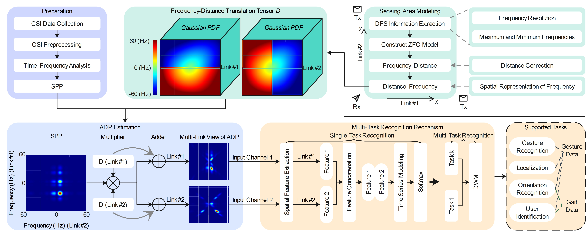

<h1 align="center">D-Sense: Expanding Gesture Recognition via Wi-Fi</h1>
This code repository provides a basic implementation of D-Sense.

## Cite the Paper
*Z. Wang, Y. Liu and Z. Tao, "D-Sense: Expanding Gesture Recognition via Wi-Fi," in IEEE Transactions on Mobile Computing, doi: 10.1109/TMC.2026.3709191.*

## Introduction
D-Sense is a general-purpose wireless sensing system based on Wi-Fi signals that supports multiple wireless sensing tasks. By leveraging Channel State Information (CSI) from gesture data, D-Sense enables both in-domain and cross-domain gesture recognition, in-domain and cross-domain user authentication, orientation recognition, and localization. Using CSI data from gait signals, it further supports user authentication and trajectory recognition. In addition, we conduct several extended experiments on D-Sense.

In this repository, we release the code for extracting the Absolute Distance Profile (ADP) (```/ADP_Estimates``` folder) and the sensing and recognition models (```/D-SenseModel``` folder). The following sections provide a description of this codebase.

<p align="center">
<strong>Overall architecture of the D-Sense system.</strong><br>

</p>

## Preparations
This section introduces the requirements for running this codebase.

### ADP Estimates
We recommend using MATLAB R2023b or later to extract ADP. The procedure is as follows:

- Download the ```/ADP_Estimates``` directory from this repository.
- Launch MATLAB and set the working directory to ```/ADP_Estimates```.
- Add ```/ADP_Estimates/CSI_to_DFS``` and ```/ADP_Estimates/generate_ADP``` to the MATLAB path using the "Add Folder and Subfolders" function.
### D-Sense Model

#### Hardware
- We recommend using an NVIDIA RTX 4060 (8GB) or higher GPU.
- A minimum of 32 GB RAM is recommended.

#### Software
- The D-SenseModel is trained using TensorFlow 2.18.0. Since TensorFlow ≥ 2.11.0 does not support native GPU acceleration on Windows, we recommend using WSL2 to set up an Ubuntu 22.04 LTS environment on Windows 11, where GPU acceleration can be properly enabled. If you are using a server with a native Linux system, this requirement can be ignored.

#### Environment Setup
**1. Create a Conda environment named D-Sense based on Python 3.10 and activate it**
```bash
conda create -n D-Sense python=3.10 -y
conda activate D-Sense
```

**2. Install TensorFlow**
```bash
pip install --upgrade pip
pip install tensorflow==2.18.0
```

**3. Install CUDA**

Install CUDA 12.5 from the official NVIDIA [website](https://developer.nvidia.com/cuda-12-5-0-download-archive?target_os=Linux&target_arch=x86_64&Distribution=WSL-Ubuntu&target_version=2.0&target_type=deb_local), or install it via the following commands:
```bash
wget https://developer.download.nvidia.com/compute/cuda/repos/wsl-ubuntu/x86_64/cuda-wsl-ubuntu.pin
sudo mv cuda-wsl-ubuntu.pin /etc/apt/preferences.d/cuda-repository-pin-600
wget https://developer.download.nvidia.com/compute/cuda/12.5.0/local_installers/cuda-repo-wsl-ubuntu-12-5-local_12.5.0-1_amd64.deb
sudo dpkg -i cuda-repo-wsl-ubuntu-12-5-local_12.5.0-1_amd64.deb
sudo cp /var/cuda-repo-wsl-ubuntu-12-5-local/cuda-*-keyring.gpg /usr/share/keyrings/
sudo apt-get update
sudo apt-get -y install cuda-toolkit-12-5
```

**4. Install additional dependencies**
```bash
pip install numpy scipy pandas scikit-learn tqdm
```

> ❗ Ensure that the ```/D-SenseModel/D_Sense_DNN``` folder is located at the same level as ```/D-SenseModel/main.py```.
